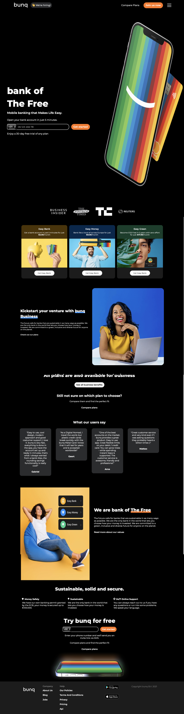
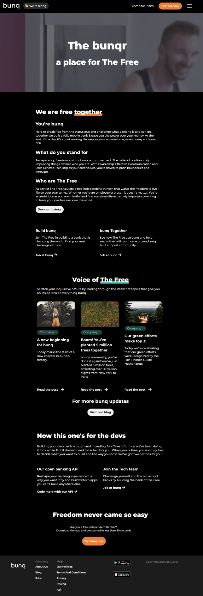
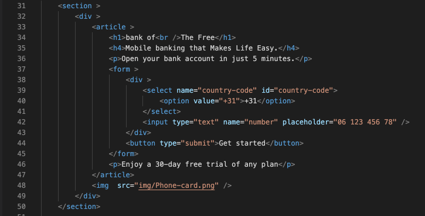
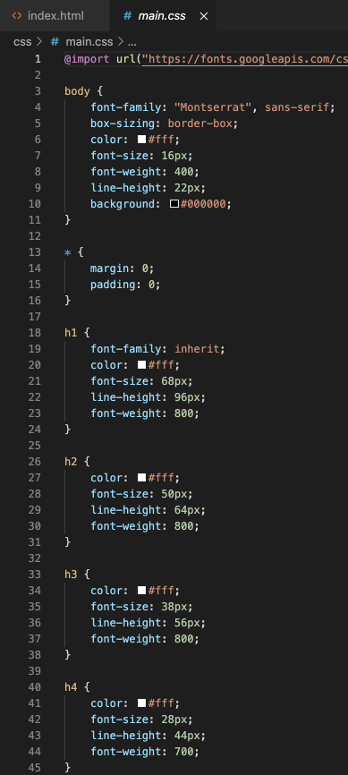
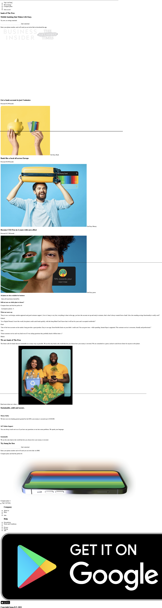
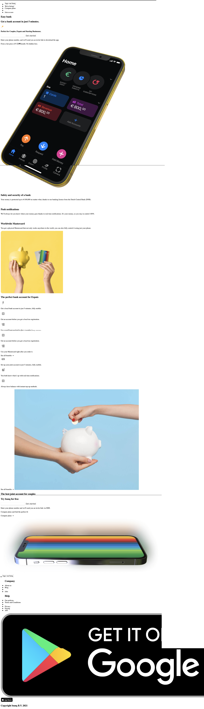
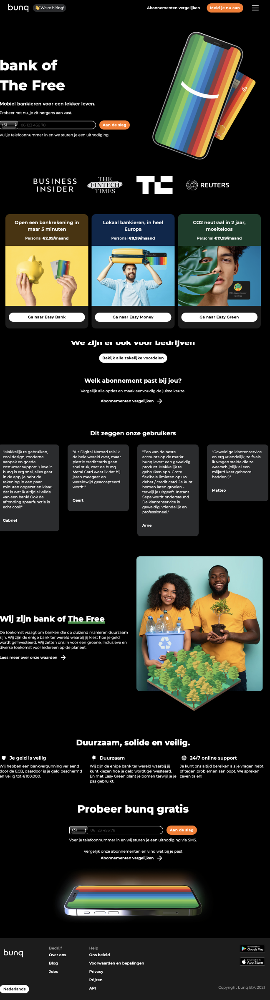
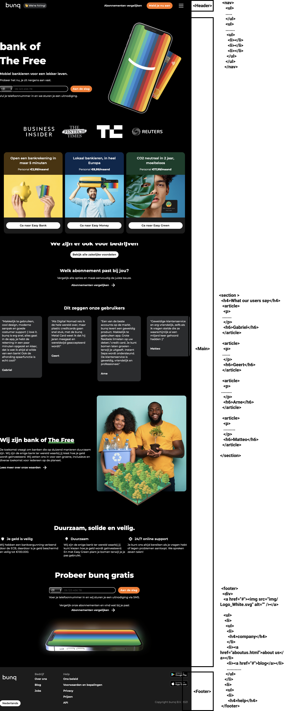
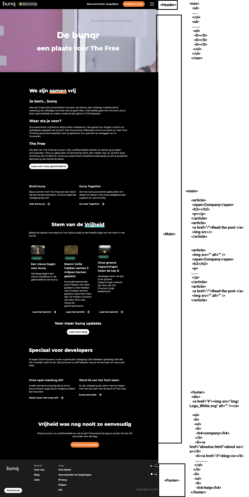

# Procesverslag
**Auteur:** -Raouf Ouaziz-

Markdown cheat cheet: [Hulp bij het schrijven van Markdown](https://github.com/adam-p/markdown-here/wiki/Markdown-Cheatsheet). Nb. de standaardstructuur en de spartaanse opmaak zijn helemaal prima. Het gaat om de inhoud van je procesverslag. Besteedt de tijd voor pracht en praal aan je website.

## Bronnenlijst
1. https://developer.mozilla.org/en-US/docs/Web/CSS/:nth-child
2. https://www.w3schools.com

## Eindgesprek (week 7/8)

-Het eindgesprek heb ik helaas niet kunnen houden doordat ik nog altijd problemen had met mijn gezondheid, deze week heb ik wel Danny gesproken om te kijken of eventueel wat uitstel kon krijgen. Ik liep nog heel wat achter en wist niet of ik het wel zou halen of niet in combinatie met de meerdere vakken die ik op dat moment had.-

-Na het spreken van Danny heb ik mezelf beloofd dat ik dit vak af zou ronden met een voldoende en ik mijn uiterste best hiervoor zou doen. Door deze inzet heb ik een responsive webpage kunnen maken waarmee ik meer dan gelukkig ben.-

**Screenshot(s):**

Eindresultaat Homepage:

Eindresultaat About Us:

## Voortgang 3 (week 6)

-Gedurende week 6-7 kon ik vrij weinig doen aan mijn studie, doordat ik een operatie ben ondergaan gedurende deze week kon ik helaas niet verder werken en heb ik besloten om mijn gezondheid boven mijn studiewerk te kiezen. -

## Voortgang 2 (week 5)

-Na het hebben ontvangen van feedback op de HTML die ik had was het voor mij duidelijk wat er veranderd moest worden. Dit waren de grootste feedback punten.-

- Maak minder gebruik van sections en articles,
- Gebruik ipv 
 andere semantische oplossingen zoals :nth of type.
  
-Ik heb wat aanpassingen gemaakt na deze feedback ronde, het HTML gedeelte heb ik verbeterd en hier heb ik een korte CSS gedeelte bij gemaakt om te proberen of alles werkt.
  
  HTML
 

  CSS
 

## Voortgang 1 (week 3)

### Stand van zaken

-Tijdens het maken van het HTML gedeelte van de webpage vond ik het erg lastig om gelijk te weten waar je nou article, section, etc gebruikt. Doordat ik dit niet echt wist had ik enorm veel van deze elementen in mijn html staan. Gelukkig doordat ik nog een beetje weet van vorig jaar kon ik het HTML gedeelte wel nog gewoon maken. De aanpassingen zouden na de les gebeuren, zodra ik het feedback heb ontvangen van de docent.-

**Screenshot(s):**

-screenshot(s) van hoe ver je bent-
Homepage: 

About us:

VOORTGANG CODE PEN:

Typografie opdr 1: https://codepen.io/raoufouaziz/pen/oNxEwYx
Typografie opdr 2: https://codepen.io/raoufouaziz/pen/dyMdzvm

Positioneren opdr 1:https://codepen.io/raoufouaziz/pen/YzqeEwW

Flexbox opdr 1: https://codepen.io/raoufouaziz/pen/WNwJQPy

## Intake (week 1)

**Je startniveau:** -blauw-

**Je focus:** -responsive-

**Je opdracht:** -https://www.bunq.com

**Screenshot Bunq.com webpagina:** 

Homepage Bunq: 

About us Bunq: 

**Breakdown-schets(en):**

Breakdown schets Homepage: 

Breakdown schets About us:

